# InboxFlow Folder Structure Flowchart

This flowchart documents the current project layout and focuses on source-owned folders. Generated/vendor directories such as `node_modules`, most build outputs, and IDE caches are intentionally omitted unless they help identify a separate app surface.

## Mermaid Flowchart

```mermaid
flowchart TD
    A[inboxflow]

    A --> B[client]
    B --> B1[public]
    B --> B2[src]
    B2 --> B21[assets]
    B2 --> B22[components]
    B22 --> B221[analytics]
    B22 --> B222[common]
    B22 --> B223[email]
    B22 --> B224[layout]
    B22 --> B225[ui]
    B2 --> B23[context]
    B2 --> B24[hooks]
    B2 --> B25[lib]
    B2 --> B26[pages]
    B2 --> B27[services]
    B2 --> B28[utils]

    A --> C[server]
    C --> C1[logs]
    C --> C2[scripts]
    C --> C3[src]
    C --> C4[tests]
    C --> C5[uploads]
    C3 --> C31[config]
    C3 --> C32[controllers]
    C3 --> C33[middleware]
    C3 --> C34[models]
    C3 --> C35[modules]
    C35 --> C351[analytics]
    C35 --> C352[attachments]
    C35 --> C353[audit]
    C35 --> C354[modifications]
    C35 --> C355[threads]
    C3 --> C36[queues]
    C3 --> C37[routes]
    C3 --> C38[scripts]
    C3 --> C39[services]
    C3 --> C310[sockets]
    C3 --> C311[utils]
    C3 --> C312[validators]

    A --> D[my-task]
    D --> D1[environment]
    D --> D2[logs]
    D --> D3[solution]
    D --> D4[tests]

    A --> E[processmail_app]
    E --> E1[android]
    E --> E2[ios]
    E --> E3[lib]
    E3 --> E31[config]
    E3 --> E32[models]
    E3 --> E33[providers]
    E3 --> E34[screens]
    E3 --> E35[services]
    E3 --> E36[widgets]
    E --> E4[linux]
    E --> E5[macos]
    E --> E6[test]
    E --> E7[web]
    E --> E8[windows]

    A --> F[client_old]
    F --> F1[public]
    F --> F2[src]
    F2 --> F21[assets]
    F2 --> F22[components]
    F22 --> F221[analytics]
    F22 --> F222[common]
    F22 --> F223[email]
    F22 --> F224[layout]
    F22 --> F225[ui]
    F2 --> F23[context]
    F2 --> F24[hooks]
    F2 --> F25[lib]
    F2 --> F26[pages]
    F2 --> F27[services]
    F2 --> F28[utils]

    A --> G[server_old]
    G --> G1[logs]
    G --> G2[scripts]
    G2 --> G21[logs]
    G --> G3[src]
    G3 --> G31[config]
    G3 --> G32[controllers]
    G3 --> G33[middleware]
    G3 --> G34[models]
    G3 --> G35[modules]
    G35 --> G351[analytics]
    G35 --> G352[attachments]
    G35 --> G353[audit]
    G35 --> G354[auth]
    G35 --> G355[dashboard]
    G35 --> G356[emails]
    G35 --> G357[modifications]
    G35 --> G358[threads]
    G3 --> G36[queues]
    G3 --> G37[routes]
    G3 --> G38[scripts]
    G3 --> G39[services]
    G3 --> G310[sockets]
    G3 --> G311[utils]
    G3 --> G312[validators]
    G --> G4[uploads]

    A --> H[logs]
    A --> I[.vscode]
    A --> J[Root files]
    J --> J1[README.md]
    J --> J2[Dockerfile]
    J --> J3[docker-compose.yml]
    J --> J4[.env.docker]
    J --> J5[.env.docker.example]
```



## Plain Tree View

```text
inboxflow/
|-- .vscode/
|-- client/
|   |-- public/
|   `-- src/
|       |-- assets/
|       |-- components/
|       |   |-- analytics/
|       |   |-- common/
|       |   |-- email/
|       |   |-- layout/
|       |   `-- ui/
|       |-- context/
|       |-- hooks/
|       |-- lib/
|       |-- pages/
|       |-- services/
|       `-- utils/
|-- client_old/
|   |-- public/
|   `-- src/
|       |-- assets/
|       |-- components/
|       |   |-- analytics/
|       |   |-- common/
|       |   |-- email/
|       |   |-- layout/
|       |   `-- ui/
|       |-- context/
|       |-- hooks/
|       |-- lib/
|       |-- pages/
|       |-- services/
|       `-- utils/
|-- logs/
|   |-- combined.log
|   `-- error.log
|-- my-task/
|   |-- environment/
|   |-- logs/
|   |-- solution/
|   `-- tests/
|-- processmail_app/
|   |-- android/
|   |-- ios/
|   |-- lib/
|   |   |-- config/
|   |   |-- models/
|   |   |-- providers/
|   |   |-- screens/
|   |   |-- services/
|   |   `-- widgets/
|   |-- linux/
|   |-- macos/
|   |-- test/
|   |-- web/
|   `-- windows/
|-- server/
|   |-- logs/
|   |-- scripts/
|   |-- src/
|   |   |-- config/
|   |   |-- controllers/
|   |   |-- middleware/
|   |   |-- models/
|   |   |-- modules/
|   |   |   |-- analytics/
|   |   |   |-- attachments/
|   |   |   |-- audit/
|   |   |   |-- modifications/
|   |   |   `-- threads/
|   |   |-- queues/
|   |   |-- routes/
|   |   |-- scripts/
|   |   |-- services/
|   |   |-- sockets/
|   |   |-- utils/
|   |   `-- validators/
|   |-- tests/
|   `-- uploads/
|-- server_old/
|   |-- logs/
|   |-- scripts/
|   |   `-- logs/
|   |-- src/
|   |   |-- config/
|   |   |-- controllers/
|   |   |-- middleware/
|   |   |-- models/
|   |   |-- modules/
|   |   |   |-- analytics/
|   |   |   |-- attachments/
|   |   |   |-- audit/
|   |   |   |-- auth/
|   |   |   |-- dashboard/
|   |   |   |-- emails/
|   |   |   |-- modifications/
|   |   |   `-- threads/
|   |   |-- queues/
|   |   |-- routes/
|   |   |-- scripts/
|   |   |-- services/
|   |   |-- sockets/
|   |   |-- utils/
|   |   `-- validators/
|   `-- uploads/
|-- .env.docker
|-- .env.docker.example
|-- .gitignore
|-- docker-compose.yml
|-- Dockerfile
`-- README.md
```

## Notes

- `client/` and `server/` appear to be the active web app surfaces.
- `client_old/` and `server_old/` are preserved legacy copies.
- `processmail_app/` is a separate Flutter application inside the same repo.
- Omitted from the diagram: `node_modules/`, most generated `build/` outputs, and transient tool caches.
